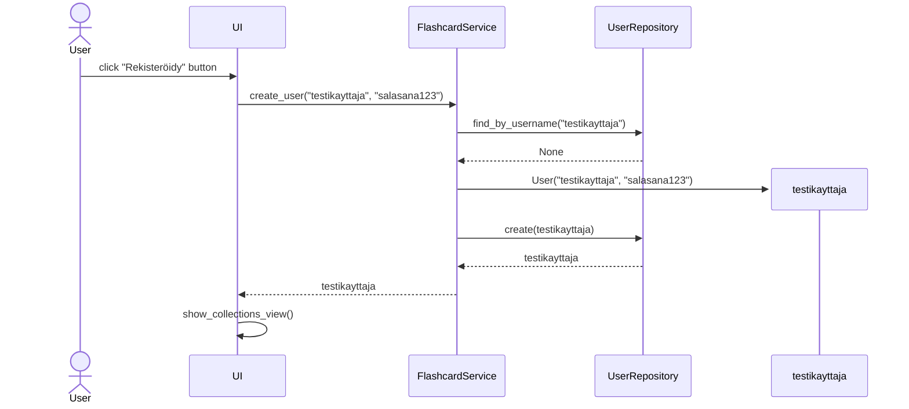
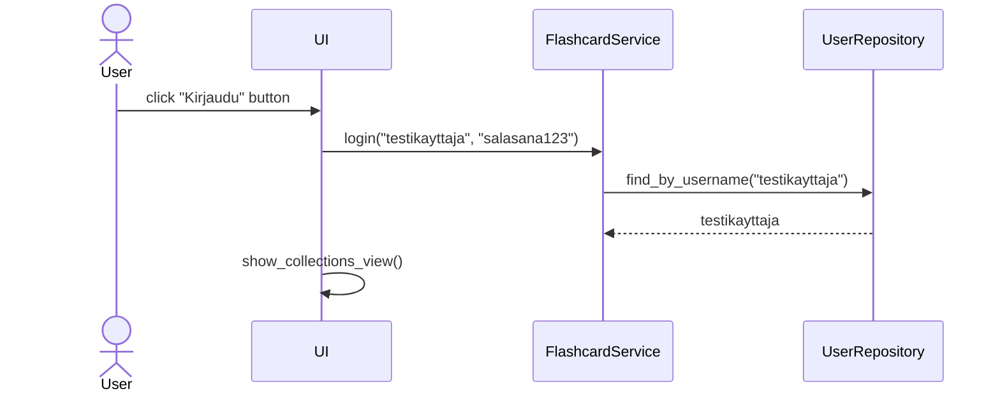
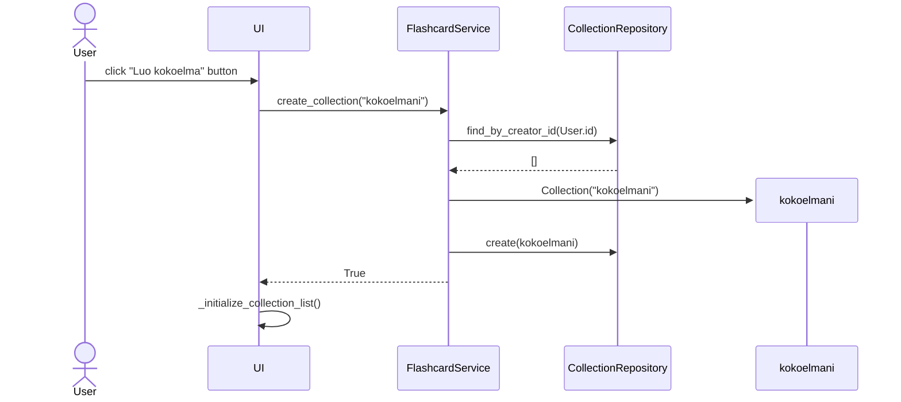
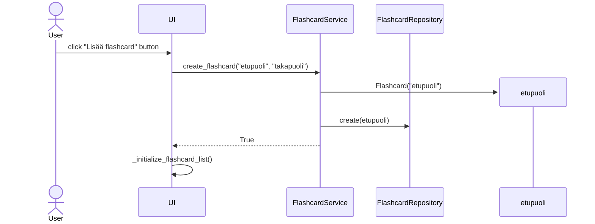

# Arkkitehtuurikuvaus

## Rakenne

Ohjelmassa on käytössä kuvanmukainen kerrosarkkitehtuuri (UI, sovelluslogiikka, tietokantaliikenne). Kuvasta ilmenee myös pakkausrakenne.

## Käyttöliittymä

Käyttöliittymässä on 7 näkymää:
- Sisäänkirjautuminen (sovelluksen aloitusnäkymä)
- Rekisteröityminen
- Omat flashcard-kokoelmat
- Flashcardit (yksittäisen kokoelman sisältö)
- Harjoittelu
- Palaute
- Julkiset flashcard-kokoelmat

Jokaisella näkymällä on oma luokka sekä joillain näkymillä on apuluokkia näkymien sisäisten "alinäkymien" (esim. listojen) näyttämiseen. UI-luokka hoitaa näkymien vaihtamisen.

Käyttöliittymä kommunikoi sovelluslogiikan (flashcard_service) kanssa, joka toteuttaa sovelluksen varsinaisen toiminnallisuuden.

## Toiminnallisuudet
Sekvenssikaavioita joistain ei täysin itsestään selvistä ydintoiminnallisuuksista

### Uuden käyttäjän luominen

### Käyttäjän kirjautuminen

### Kokoelman luominen

### Flashcardin luominen

