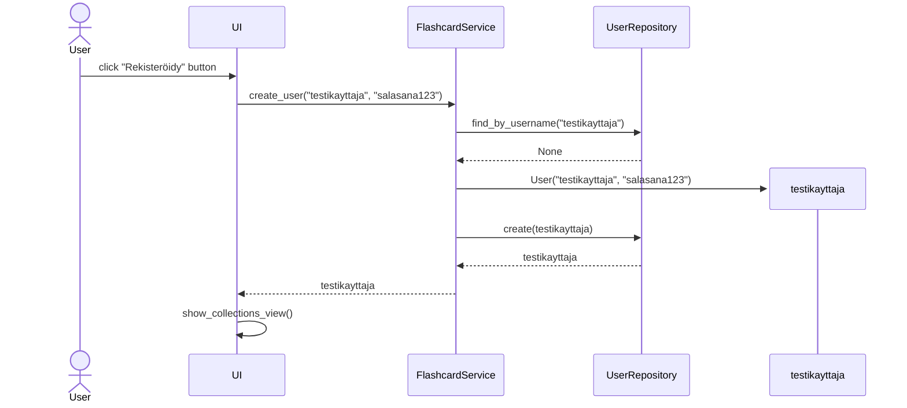
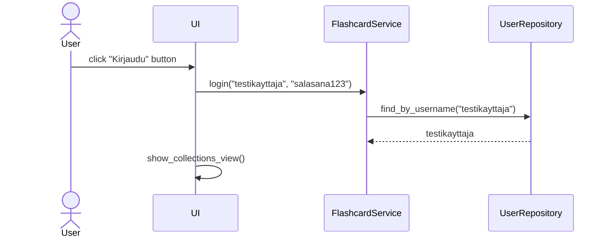
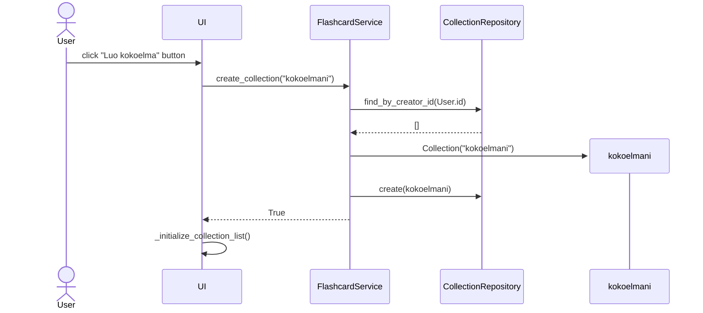
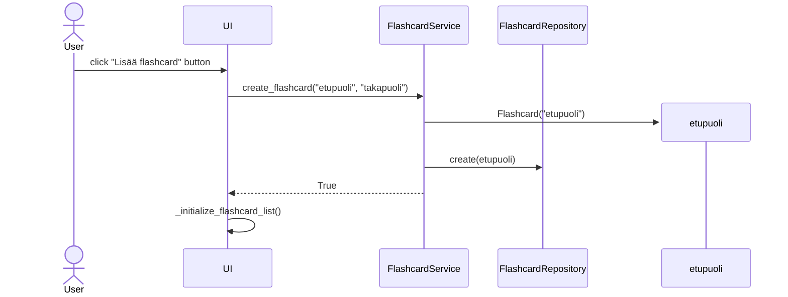

# Arkkitehtuurikuvaus

## Rakenne

Ohjelmassa on käytössä kuvanmukainen kerrosarkkitehtuuri (UI, sovelluslogiikka, tietokantaliikenne). Kuvasta ilmenee myös pakkausrakenne.

## Käyttöliittymä

Käyttöliittymässä on 6 näkymää:
- Sisäänkirjautuminen (sovelluksen aloitusnäkymä)
- Rekisteröityminen
- Flashcard-kokoelmat (voi vaihtaa yksityisten ja kaikkien julkisten välillä)
- Flashcardit (yksittäisen kokoelman sisältö)
- Harjoittelu
- Palaute

Jokaisella näkymällä on oma luokka sekä joillain näkymillä on apuluokkia näkymien sisäisten "alinäkymien" (esim. listojen) näyttämiseen. UI-luokka hoitaa näkymien vaihtamisen.

Käyttöliittymä kommunikoi sovelluslogiikan (`flashcard_service`) kanssa, joka toteuttaa sovelluksen varsinaisen toiminnallisuuden.

## Sovelluslogiikka

Sovelluslogiikasta vastaa täysin (tai niin pitkälti kuin se on saatu käyttöliittymästä erotettua), luokka `FlashcardService`.
Käyttöliittymä kutsuu sovelluslogiikan metodeja, jotka taas muuttavat sovelluksen tilaa ja kutsuvat edelleen repositorioita tietokantaoperaatioita varten.

Sovelluslogiikan metodit vastaavasti palauttavat tarvittaessa tietoa kutsujen onnistumisesta, jotta käyttöliittymä tietää, mitä muutoksia näkymässä tulisi tapahtua.

## Tietojen tallennus

Sovellus käyttää kaikkeen tiedon tallentamiseen ja hakemiseen SQLite-tietokantaa, jossa on kolme (3) taulua:
- `users`, joka sisältää käyttäjien tunnusten tiedot
- `collections`, joka sisältää flashcard-kokoelmien tiedot
- `flashcards`, joka sisältää flashcardien tiedot

Vastaavasti repositoriot `UserRepository`, `CollectionRepository` ja `FlashcardRepository` hoitavat tietokantoihin liittyvät kyselyt.

Tietokantataulut määritellään tiedostossa `flashcards/src/initialize_database.py`, joka löytyy [täältä](https://github.com/Cherrybowll/ohte-harjoitustyo/blob/master/flashcards/src/initialize_database.py).

Tietokantatiedosto määritellään tiedostossa `flashcards/.env`, muuttujassa `DATABASE_FILENAME` (oletuksena `database.sqlite`).
Tiedoston sijaitsee hakemistossa `flashcards/data/`

## Toiminnallisuudet

Sekvenssikaavioita ydintoiminnallisuuksista.

### Uuden käyttäjän luominen

### Käyttäjän kirjautuminen

### Kokoelman luominen

### Flashcardin luominen

### Muut toiminnallisuudet

Sovelluksesta löytyy paljon muitakin ominaisuuksia, joiden sekvenssikaaviot toistavat samaa logiikkaa:
- Käyttäjä yrittää tehdä jonkin toiminnon käyttöliittymän kautta
- Käyttöliittymä kutsuu toiminnosta vastaavaa metodia sovelluslogiikan palvelusta `FlashcardService`
- Sovelluslogiikka kutsuu tarvittaessa repositorioiden metodeja datan hakemista tai tallentamista varten
- Repositoriot tekevät tietokantakyselyt ja palauttavat tiedon sovelluslogiikalle
- Sovelluslogiikka käsittelee dataa toivotulla tavalla
- Sovelluslogiikka palauttaa käyttöliittymälle tietoa, jonka perusteella käyttöliittymä päättelee, pitääkö näkymän muuttua

### Rakenteelliset heikkoudet

Välttääkseni todella copy-pastettuja UI-näkymiä, jouduin lisäämään jonkin verran tarkistuksia käyttöliittymäkoodiin, joka osaltaan,
vaikkakin melko pienissä määrin, kaventaa eroa käyttöliittymän ja sovelluslogiikan välillä.

Tietoa hakevissa metodeissa saattaa olla vielä pientä copy-pasten tuntua, vaikka sain niitä loppupalautusta varten paljon siivottua.
