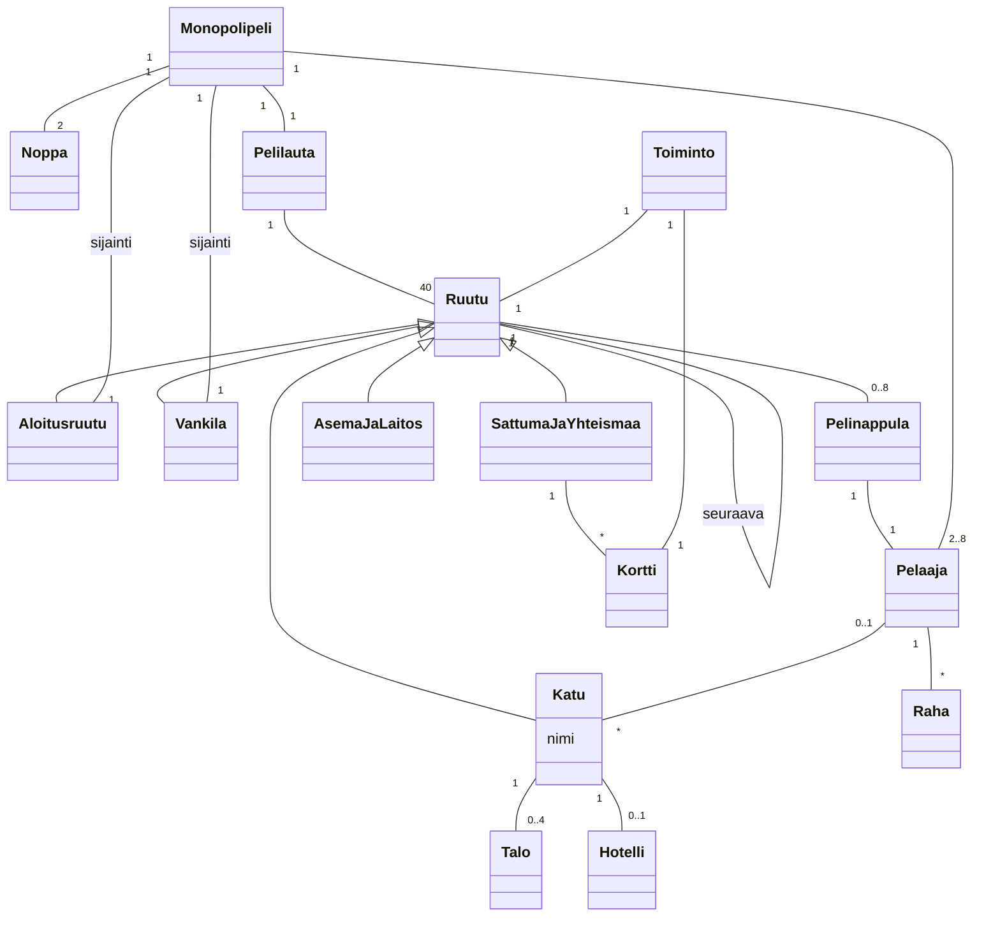

## Monopoli

Kaavio ei asetu kovin miellyttävästi. Merkitsin rahan luokkana, vaikka se voisi ehkä jopa mieluummin olla Pelaajan muuttuja.

```mermaid
 classDiagram
    Monopolipeli "1" -- "2" Noppa
    Monopolipeli "1" -- "1" Pelilauta
    Pelilauta "1" -- "40" Ruutu
    Ruutu <|-- Aloitusruutu
    Ruutu <|-- Vankila
    Ruutu <|-- SattumaJaYhteismaa
    Ruutu <|-- AsemaJaLaitos
    Ruutu <|-- Katu
    Ruutu "1" -- "1" Ruutu : seuraava
    Ruutu "1" -- "0..8" Pelinappula
    Pelinappula "1" -- "1" Pelaaja
    Pelaaja "2..8" -- "1" Monopolipeli
    Toiminto "1" -- "1" Ruutu
    SattumaJaYhteismaa "1" -- "*" Kortti
    Toiminto "1" -- "1" Kortti
    Pelaaja "0..1" -- "*" Katu
    Katu "1" -- "0..4" Talo
    Katu "1" -- "0..1" Hotelli
    Pelaaja "1" -- "*" Raha
    Monopolipeli "1" -- "1" Aloitusruutu : sijainti
    Monopolipeli "1" -- "1" Vankila : sijainti

 class Katu {
    nimi
}
```
